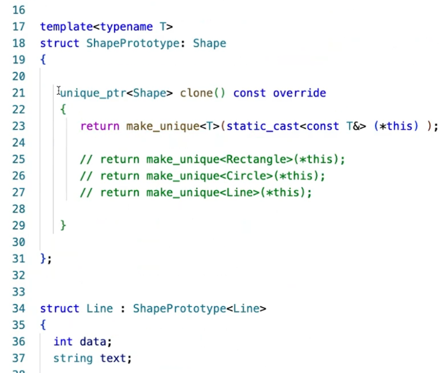

依赖倒置:依赖接口而不是实现，高层、底层都依赖中间层（稳定接口）

### 如何设计？

**寻找变化点**，每个模式都有稳定点和变化点，在变化点应用设计模式。

**分解①和抽象②变化产生的复杂性**，从而==隔离和抵御变化==。（单个复杂问题化为多个简单问题）（抽取本质）

**复用**。

**不要硬用**。

# 设计思想

## 设计模式（Design Pattern）

### 从管理的角度理解设计模式


### 创建型（Creational）

### 结构型（Structural）

### 行为型（Behavioral）

#### 模板方法（Template Method）

简介：将框架定义在抽象基类中，而将具体算法的实现延迟到其具体子类中。

适用场景：==需要代码复用==

注意：

1.  流程&骨架（稳定、复用）放在基类（注意此方法不是虚函数），拓展点（变化）留给子类

2.  虚函数尽量不public,注意==构造析构函数里的函数做静态绑定==

    


**ScopeGuard**: RAII变体，利用析构完成可能由异常造成的函数不调用

**biulder**模式：分步骤构建一个复杂对象，分为对象的**构建**和**表示**与**构建构成**，只变化构建(biulder)

**strategy**模式: 策略模式面向对象版，消除if else，符合开闭原则，意思是使用基类智能指针+多态替代原来的代码

**policy**设计习语：泛型版，模板编译时多态

**Factory Method**:工厂方法有碎片化的问题，同时有变参模板工厂方法的变种


-   **Abstract factory**:一系列类相关联工厂时使用，抽象工厂产生一系列相关联类的对象，问题是难以应对对象种类个数的变动
-   **Static Factory**： 
-   **prototype原型模式**：将具体类与具体类的工厂放到一起，`create_object` 变为 `clone`注意要实现深拷贝，保持多个原型，然后调用他们的`clone`，相比于工厂原型更加轻便，但具有一个初始状态。可以使用crtp的方式把多个类放到一个里面如下：（之所以要分成shape & shapeproto是因为shapeproto类不能作为统一基类，而是一个模板一个类）





-   一种拷贝和移动构造符的写法，利用raii保证异常安全


-   **单一职责模式**：装饰模式，在大量继承时，类与类之间可能存在很多种配合，造成类的爆炸，这时需要我们将他由继承改为继承加动态组合的形式，或使用模板，将一个类T作为一个类的基类，在对T做扩展
-   **mixin混入类**：变参模板多继承，把继承的父类作为属性随意组合
-   **bridge桥模式**：支持多平台、多业务版本，应对类的多维变化。继承转组合，同时对被继承的类细分成多个功能类，n*m -> n+m
-   **设计习语 Pimpl**：将数据成员声明为指针 detail

### 设计习语（idiom）

#### 奇异递归模板模式（CRTP）

Curiously Recurring Template Pattern

简介：使用模板模拟虚函数，跳过虚函数，性能高（一般提升不是特别多，除非虚函数频繁调且表复杂）

适用场景：基类模板化静态多态（不能基类指针调用子类函数）、==性能要求极苛刻时使用==

优点：

1.  **可以在编译时就检查错误**，而不是在运行时才发现。因为 CRTP 模式中的继承关系是在编译时就确定的，所以如果派生类没有实现基类中虚函数，则会在编译时产生错误，从而避免了在运行时才发现这个问题。
2.  **更好的性能**。由于 CRTP 使用静态绑定（Static Binding），而不是动态绑定（Dynamic Binding），因此==不需要在运行时处理虚函数表==，从而可以提高程序执行效率。
3.  **减少内存使用**。由于 CRTP 模式不需要虚函数表，因此可以节省内存空间。

缺点：

1.  **不适用于需要多态继承的场景**，即如果有一个基类指针指向一个派生类对象并且需要根据基类指针调用相应的方法，那么就不能使用 CRTP 模式。因为 CRTP 模式中的静态绑定只能在编译时确定，而无法在运行时动态修改。

注意：

1.  **模板参数必须是直接或间接继承于当前 CRTP 基类的类。**
2.  **派生类必须实现基类中所有重载了的函数。**（因为 CRTP 基类函数调用的是派生类中重载的函数，如果派生类没有实现基类中的某个函数，编译器将无法生成代码，从而导致编译错误）

示例代码：

```cpp
// 定义一个 CRTP 基类
template <typename T>
class Base {
  // 基类方法
 public:
  void print() {
    T* derived = static_cast<T*>(this);
    derived->printImpl();
  }
};

// 派生自 CRTP 基类的子类
class Derived : public Base<Derived> {
  // 子类重载方法
 public:
  void printImpl() {
    std::cout << "Hello, CRTP!" << std::endl;
  }
};

int main() {
  Derived derived;
  derived.print();
  return 0;
}
```


#### 资源获取即初始化（RAII）

Resource Acquisition Is Initialization

栈对象方式确保析构，例如用完即扔的指针使用智能指针
